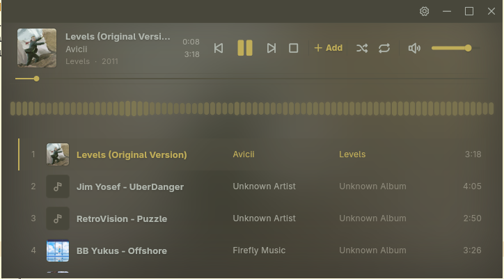

<div align="center">
    <h1>Halcyon</h1>
    <p>A simple, minimalist music player created with Flutter.</p>
    
</div>

## Building & Using

```shell
# Clone the repository
git clone https://github.com/exoad/halcyon
cd halcyon
# Install dependencies
flutter pub get
# Run the app
flutter run
```

> A rewrite of my original creation: [Halcyon](https://github.com/exoad/Halcyon.c)